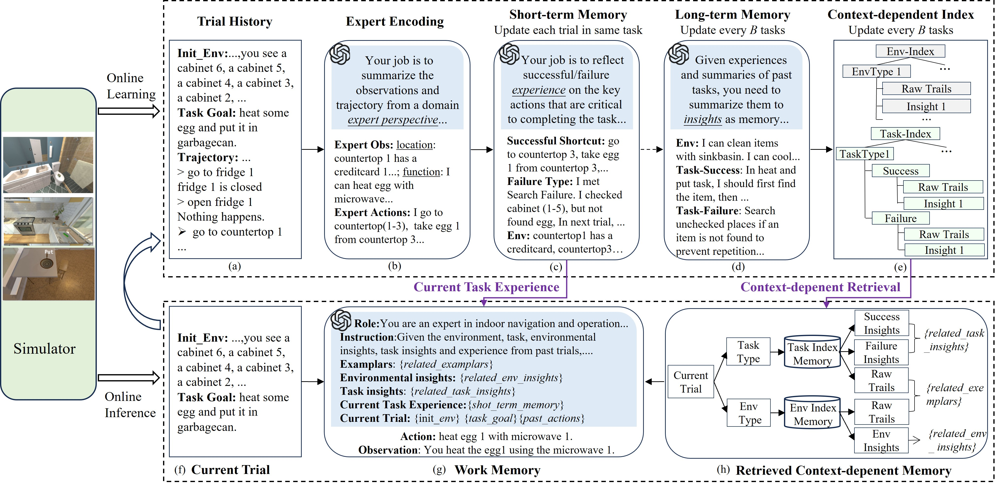

# CDMem: An Efficient Context-Dependent Memory Framework for LLM-Centric Agents

This repository contains the code for the paper **"An Efficient Context-Dependent Memory Framework for LLM-Centric Agents"**. The project provides a framework for enhancing the performance of LLM-centric agents by leveraging context-dependent memory.



## Table of Contents

- [Installation](#installation)
- [Running AlfWorld Experiments](#running-alfworld-experiments)
- [Running ScienceWorld Experiments](#running-scienceworld-experiments)
- [License](#license)

## Installation

Follow these steps to set up the project:

1. **Clone the repository**:
   ```bash
   git clone https://github.com/piri-gao/CDMem.git
   ```

2. **Create a conda environment**:
   ```bash
   conda create -n cdmem python=3.10
   conda activate cdmem
   ```

3. **Install dependencies**:
   ```bash
   pip install -r requirements.txt
   ```

4. **Set up the AlfWorld environment**:
   Follow the instructions in `data/alfworld/README.md` to install the AlfWorld environment.

5. **Validate the AlfWorld installation**:
   ```bash
   cd scripts
   sh run_alfworld_install_validation.sh
   ```

6. **Configure OpenAI Key**:
   Edit the `scripts/set_api.sh` file to include your OpenAI API key.

## Running AlfWorld Experiments

To run the AlfWorld experiments using the CDMem framework:

```bash
cd scripts
sh run_cdmem.sh
```

To run other algorithms, such as Reflexion, use the corresponding script:

```bash
cd scripts
sh run_reflexion.sh
```

## Running ScienceWorld Experiments

To run the ScienceWorld experiments using the CDMem framework:

```bash
cd scripts
sh run_cdmem_for_scienceworld.sh
```

## License

This project is licensed under the [MIT License](LICENSE).

